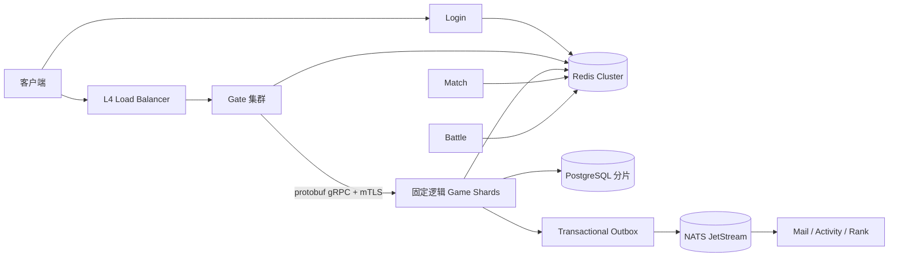

# NewGame 可扩展架构

本文描述当前代码已经落实的扩展与一致性边界。容量数字只能作为规划起点；任何“10 万/100 万 CCU”目标都必须由目标云环境、真实协议流量和数据库数据量下的压测结果证明。

## 总体拓扑



Login 和 Gate 是可水平扩展的接入服务。Game 是按角色确定性路由的有状态单写者；Match、Battle、Presence、Session 和排行榜的共享状态位于 Redis；角色与经济数据位于 PostgreSQL；跨服务事件通过事务 Outbox 和 JetStream 投递。

## 不可破坏的系统不变量

### 角色路由与单写者

```go
shardID := shard.ForRole(roleID, shardCount)
service := shard.ServiceName(shardID)
```

- `shard_count` 是数据路由版本，不是普通副本数。
- Gate、GameClient、Login 和重分片工具必须使用同一取模算法。
- Game Manager 会拒绝不属于本分片的角色。
- 首次加载角色时，数据库原子递增 `owner_epoch`。旧进程即使仍存活，也会被 CAS 拒绝写入。
- 角色快照同时用 `version` 和 `owner_epoch` 做 CAS；冲突不会被静默覆盖。
- 改变 `shard_count` 必须先运行 `tools/reshard` 的复制、校验和切换流程。工具默认不删源数据，只有显式 `-delete-source` 才会清理。

Game StatefulSet 因此不能绑定普通 HPA。Gate 可以 HPA；Game 扩容属于数据迁移操作。

### Actor 事务边界

- 同一角色的逻辑通过 Mailbox 串行执行。
- 会改变角色的协议处理与 CAS 保存处于同一 Mailbox 任务中。
- 保存失败时恢复变更前快照，再向调用方返回失败，避免重试导致重复升级或重复发奖。
- Dungeon 的角色快照与排行榜事件在同一个 PostgreSQL 事务中提交。
- 关停会停止接收请求、等待后台任务、限时刷新并关闭所有 Actor。

异步保存仍可用于非关键合并写，但已确认成功的关键变更必须同步持久化后才能响应。

### 经济与支付

- 所有跨服务发奖都携带不可变 `source`，`economy_ledger(role_id, source)` 提供数据库级幂等。
- 发奖与角色快照更新在同一数据库事务中提交。
- 拍卖使用 Pending→Open→Reserved→Sold 状态机；买方扣款、物品交付和卖方收入均使用账本来源键。
- 商品价格由 Pay 服务配置决定，客户端金额不可信。
- 支付回调校验时间戳、nonce、HMAC、订单商品、金额和支付平台交易号；nonce 与交易号都有唯一性保护。

### 可靠事件

- 角色快照与 `event_outbox` 同事务提交。
- 多个 Game 实例使用 `FOR UPDATE SKIP LOCKED` 租约发布 Outbox。
- JetStream 发布必须拿到持久化 ACK。
- Mail 和 Activity 使用 `event_inbox` 去重。
- Rank 写入使用单调更新，旧的重复事件不会覆盖更高分数。
- 消费失败显式 NAK，达到最大次数后进入 `_DLQ.*`。

### 会话与在线状态

- HTTP 业务接口从 Bearer/X-Session-Token 建立可信身份，不接受请求体里的 `role_id` 作为身份。
- Gate Presence 包含随机 `session_id` generation。
- Renew、Remove 和跨 Gate Kick 都比较 generation；旧连接不能删除新连接的 Presence。
- Session 与 Presence 存在 Redis，服务在生产环境连接失败时拒绝启动。

### Match 与 Battle

- 多副本共享的 ticket、room、result 都写 Redis，并有 TTL。
- Match 建房失败会把已预留玩家补偿回队列。
- room、ticket 使用高熵随机 ID。
- Battle 建房、查询、结算均为内部鉴权接口。
- 本地内存实现只用于开发或测试回退，生产配置必须使用 Redis。

## 服务间安全

- 生产配置必须设置 `NG_INTERNAL_SECRET`。
- Gate→Game gRPC 使用生成的 protobuf API，不再使用手写 ServiceDesc/JSON codec。
- 生产 gRPC 必须配置 TLS 1.3 双向认证；共享令牌作为第二层应用鉴权。
- Game 内部端口受 Kubernetes NetworkPolicy 限制。
- 容器以 non-root、只读根文件系统、drop capabilities 和 RuntimeDefault seccomp 运行。
- Secret 不进入镜像和 Git；数据库 DSN 应启用 TLS。

## 数据库迁移

`tools/migrate` 会：

1. 连接中心库以及 `NG_POSTGRES_SHARDS` 中的所有唯一分片；
2. 获取 PostgreSQL advisory lock；
3. 先执行 `init.sql`，再按数字版本执行 `migrate_vN.sql`；
4. 每个文件单独事务提交；
5. 保存 SHA-256，拒绝已执行脚本被修改；
6. 按 `NG_SHARD_COUNT` 汇总所有物理分库的角色目录到中心库。

生产发布必须让迁移 Job 成功后再滚动服务。破坏性 schema 变更应采用 expand/migrate/contract，多版本服务兼容期间不能直接删列。

## 容量规划

默认规划值是每个 Gate 约 1–1.5 万长连接、每个 Game 逻辑分片约 2,000 在线 Actor。它们不是保证值。压测至少要覆盖：

- 登录与重连风暴；
- Gate 长连接、心跳、消息速率限制和跨 Gate 踢线；
- 单角色热点与全服热点；
- PostgreSQL CAS 冲突、连接池饱和和故障恢复；
- Redis Cluster slot、故障转移和热 key；
- JetStream 重投递、积压、DLQ 与 Outbox 恢复；
- 滚动发布、Pod 驱逐和单个 Game 分片重启。

重点告警指标：

| 指标 | 建议关注 |
|---|---|
| `ng_gate_connections` | 单 Gate 接近容量上限 |
| `ng_gate_forward_latency_seconds` | Gate→Game P95/P99 |
| `ng_online_per_shard` | 单 Game 分片在线 Actor |
| `ng_game_save_queue_depth` | 异步保存积压 |
| `ng_game_save_failed_total` | CAS/数据库保存失败 |
| `ng_http_requests_total` | 按方法、路由、状态码统计 |
| JetStream consumer pending / redelivery | 消费积压与毒消息 |
| Outbox 最老未发布时间 | 跨服务事件延迟 |

部署样例和顺序见 [`deploy/k8s/README.md`](../deploy/k8s/README.md)。
